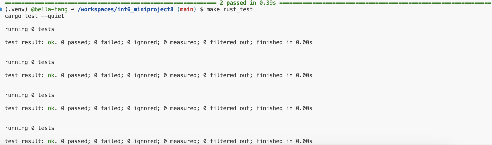

# int6_miniproject8
[](https://github.com/nogibjj/int6_miniproject8/actions/workflows/rustci.yml)
[](https://github.com/nogibjj/int6_miniproject8/actions/workflows/pythonci.yml)

This repo contains work for mini-project 8. It sets up an environment on codespaces and uses Github Actions to run a Makefile for the following: `make rust_install`, `make rust_format`, `make rust_lint`, `make rust_test`. 

Some important components:

* `Makefile`

* `Dockerfile`

* A base set of libraries for devops and web

* `githubactions` 

## Purpose of project
The purpose of this project is to rewrite a Python data processing script in Rust to compare their performance costs. Two simple functions have been implemented: `read_data()` reads in a csv while `calc_stats()` returns the mean and median for numerical columns. The Python version can be found in main.py and the Rust version can be found in lib.rs. These functions are called in main and tested in test_main.py and my_tests.rs. To make sure github actions is working properly, I use a Makefile to test various parts of my code.

## Preparation and Installation
1. Open codespaces 
2. Wait for container to be built and virtual environment to be activated with requirements.txt installed 
#### Option 1: Download Prerequisites
* (Open Codespaces)
* Install **Rust** and **Cargo** locally
  * You can install Rust using `rustup` if you haven't already:
  ```bash
  curl --proto '=https' --tlsv1.2 -sSf https://sh.rustup.rs | sh
* Run `cargo build` to build dependencies
#### Option 2: Using Prebuilt Binary Artifact
* Alternatively, you can download the prebuilt binary artifact from the latest CI/CD workflow run in the Actions tab of the GitHub repository.
  1. Go to the **Actions** tab in the repository.
  2. Select the latest successful workflow run.
  3. Scroll down to the **Artifacts** section.
  4. Download the binary named `rust-binary-artifact`.
  5. Upload the binary to your environment (i.e. Codespaces or your Linux machine)

## Data
We use a dataset called `spotify.csv` containing information on Spotify sound tracks (downloaded from Kaggle).

## Running the Scripts
`make run` to run the Python script   
`make rust_run` to run the Rust script

## Performance Analysis
| Language | Time Taken (seconds) | Memory Used (KB) |
|----------|-----------------------|------------------|
| Rust     | 0.005                 | ~0 KB            |
| Python   | 0.022                 | 13680 KB        |

The performance results show Rust completing the task (generating summary stats) in 0.005 seconds with virtually no memory usage, while Python takes 0.022 seconds and uses approximately 13.68 MB of memory. Rust is able to perform roughly **four times faster** than Python due to its zero-cost abstractions, emphasis on lower level control, and compiler nature. We also see Rust's advantage in memory usage as a result of managing memory directly instead of garbage collection. These performance metrics reflect how the two languages compare on a dataset of 114,000 rows, but we would expect Rust’s optimizations to scale effectively with even larger datasets. This makes Rust a more suitable choice for performance-sensitive tasks where speed and resource efficiency are critical.

## Check format and test errors 
1. Format code `make_format`, `make rust_format`
2. Lint code `make_lint`, `make rust_lint`
3. Test code `make_test`, `make rust_test` or `cargo test`


