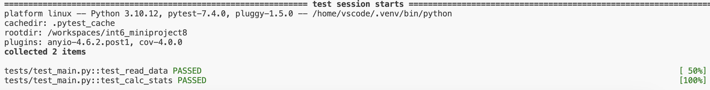

# int6_miniproject1
[](https://github.com/nogibjj/int6_miniproject7/actions/workflows/rustci.yml)

This repo contains work for mini-project 7. It sets up an environment on codespaces and uses Github Actions to run a Makefile for the following: `make rust_install`, `make rust_format`, `make rust_lint`, `make rust_test`. 

Some important components:

* `Makefile`

* `Dockerfile`

* A base set of libraries for devops and web

* `githubactions` 

## Purpose of project
The purpose of this project is to create command line tool using Rust. The file lib.rs contains a simple function that calculates the area and perimeter of a triangle given a user's side length inputs. This function is called in main.rs and tested in my_tests.rs. To make sure github actions is working properly, I use a Makefile to test various parts of my code.

## Preparation and Installation
#### Option 1: Download Prerequisites
* (Open Codespaces)
* Install **Rust** and **Cargo** locally
  * You can install Rust using `rustup` if you haven't already:
  ```bash
  curl --proto '=https' --tlsv1.2 -sSf https://sh.rustup.rs | sh
* Run `cargo build` to build dependencies
#### Option 2: Using Prebuilt Binary Artifact
* Alternatively, you can download the prebuilt binary artifact from the latest CI/CD workflow run in the Actions tab of the GitHub repository.
  1. Go to the **Actions** tab in the repository.
  2. Select the latest successful workflow run.
  3. Scroll down to the **Artifacts** section.
  4. Download the binary named `rust-binary-artifact`.
  5. Upload the binary to your environment (i.e. Codespaces or your Linux machine)

## Using Command Line Tool
#### Available rust functions located in `lib.rs`
  `calculate_triangle_area(a,b,c)`   
  `calculate_perimeter_area(a,b,c)`
#### Parameters
To use the triangle area/perimeter calculator, enter the following into the command line:
  * `cargo run -- <mode> -- <side1> <side2> <side3>`
    * **mode** can either be **area** or **perimeter**
    * **sides** should be numerical values (separated by a space)

#### Expected Output
The function will return the calculated area or perimeter or notify the user that the provided side lengths form an invalid triangle.

#### Example
`cargo run -- area -- 3 4 5` returns `Area of the triangle: 6.00`

`cargo run -- perimeter -- 3 4 5` returns `Perimeter of the triangle: 12.00`

`cargo run -- perimeter -- 3 4 1` returns `Invalid triangle sides provided.`

## Check format and test errors 
1. Format code `make rust_format`
2. Lint code `make rust_lint`
3. Test code `make rust_test` or `cargo test`

